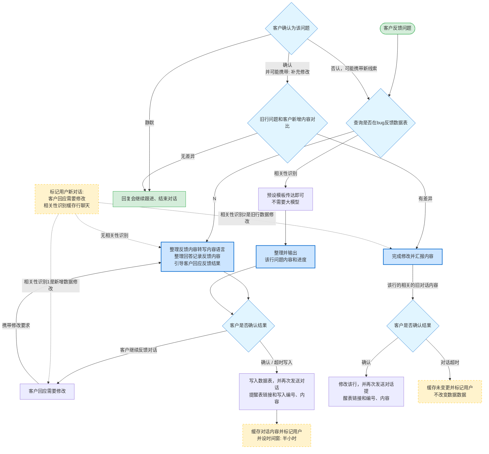

# 客户反馈处理流程架构图分析

> 源图：`d:\workspace\project\auto-test\AutoGenesis\企业微信截图_17829853587752.png`
> 复刻方式：Mermaid 流程图 + 节点关系 + 业务语义解读
> 适用场景：交接给不支持图片输入的 Claude Code 会话进行二次理解

---

## 一、流程总览（业务目标）

该架构图描述了一个**客户反馈处理系统**的完整工作流。当客户在工单/反馈表中提出问题后，系统需要完成以下核心任务：

1. **识别新反馈**与历史 bug 的相关性（避免重复建单）
2. **引导客户补充信息**形成结构化反馈
3. **判断是否需要修改数据**（vs. 仅回复说明）
4. **跟踪客户确认状态**（确认 / 不确认 / 超时）
5. **管理对话超时缓存**与用户标识，防止反馈丢失

整个系统本质是一个**"反馈录入 → 关联匹配 → 客户确认 → 数据落地"**的有限状态机，融合了：
- 表格关联性识别
- LLM 内容整理与结构化
- 对话超时异步缓存
- 多轮用户标识

---

## 二、Mermaid 流程图复刻



---

## 三、节点清单与功能说明

### 3.1 起点节点

| 节点 | 类型 | 含义 |
|---|---|---|
| **客户反馈问题** | 起点 | 流程入口，触发整个反馈处理链 |
| **回复会继续跟进、结束对话** | 终点 | 静默/无差异/不需要修改时的结束态 |

### 3.2 决策节点（菱形）

| 节点 | 含义 | 关键分支 |
|---|---|---|
| **查询是否在bug反馈数据表** | 在 bug 数据表中检索当前反馈 | • Y：相关性识别 → 模板回复<br/>• N：反馈补充分支 |
| **客户是否确认结果** | 等待客户对处理结果的确认 | • 确认 → 写入数据表<br/>• 不确认/修改要求 → 反馈补充<br/>• 对话超时 → 缓存 |
| **客户确认为该问题** | 客户对识别结果的态度 | • 静默 → 结束<br/>• 确认 → 进入对比<br/>• 否认 → 重新查询 |
| **旧行问题和客户新增内容对比** | diff 已存在行 vs 客户新提的内容 | • 无差异 → 结束<br/>• 有差异 → 反馈修改 |
| **客户是否确认结果**（右） | 修改后再次确认 | • 确认 → 修改该行<br/>• 超时 → 缓存未变更 |

### 3.3 处理节点（矩形，带浅蓝高亮）

| 节点 | 业务含义 |
|---|---|
| **整理反馈内容转写内容语言 / 整理回答记录反馈内容 / 引导客户回应反馈结果** | LLM 主导的反馈补充环节：把客户原文转写为内容语言、整理回答、引导客户确认 |
| **整理并输出该行问题内容和进度** | 命中已有行时，模板式整理输出（**不需要大模型**，使用预设模板） |
| **完成修改并汇报内容** | LLM 完成行内内容修改并向客户汇报 |

### 3.4 状态/缓存节点

| 节点 | 含义 |
|---|---|
| **缓存对话内容并标记用户<br/>并设时间窗: 半小时** | 写入后半小时内同一用户的对话会命中标记节点 |
| **标记用户新对话: 客户回应需要修改 / 相关性识别缓存行聊天** | 虚线标识，根据三种情况路由：<br/>① **无相关性识别**：走反馈补充<br/>② **相关性识别1是新增数据修改**：走客户回应需要修改<br/>③ **相关性识别2是旧行数据修改**：走完成修改并汇报内容 |
| **缓存未变更并标记用户<br/>不改变数据数据**（虚线） | 超时未确认时进入此状态，**不修改数据** |

### 3.5 写入/通知节点

| 节点 | 业务含义 |
|---|---|
| **写入数据表，并再次发送对话提醒表链接和写入编号、内容** | 新增写入：向客户回执表链接 + 编号 + 内容 |
| **修改该行，并再次发送对话提醒表链接和编号、内容** | 修改写入：向客户回执表链接 + 编号 + 内容 |

---

## 四、关键路径梳理

### 路径 A：新反馈 → 写入（最长路径）

```
客户反馈问题
  → 查询bug反馈数据表 [N]
  → 反馈补充（LLM 整理 + 引导）
  → 客户是否确认结果 [确认]
  → 写入数据表 + 发送链接编号
  → 缓存30分钟窗口
  → 结束
```

### 路径 B：已存在 bug → 模板回复（最快路径）

```
客户反馈问题
  → 查询bug反馈数据表 [相关性识别]
  → 预设模板传达即可（不需要大模型）
  → 整理并输出该行问题内容和进度
  → 客户是否确认结果 [确认]
  → 写入数据表 + 发送链接编号
  → 缓存30分钟窗口
  → 结束
```

### 路径 C：客户静默（静默退出）

```
客户反馈问题
  → 查询bug反馈数据表 [N]
  → 反馈补充
  → 客户是否确认结果 [客户继续反馈对话 → 客户回应需要修改]
  → 缓存30分钟窗口
  → 标记用户新对话 → 反馈补充（继续循环）
  → 若客户不再回复 → 系统超时缓存，结束
```

### 路径 D：客户否认（重新查询）

```
客户反馈问题
  → 查询bug反馈数据表 [相关性识别]
  → 整理并输出
  → 客户确认为该问题 [否认，可能携带新线索]
  → 查询是否在bug反馈数据表（重新进入）
```

### 路径 E：客户确认 → 修改旧行

```
客户反馈问题
  → 查询 [相关性识别]
  → 整理并输出
  → 客户确认为该问题 [确认并可能携带补充修改]
  → 旧行问题和客户新增内容对比
  ├─ 无差异 → 结束
  └─ 有差异 → 完成修改并汇报内容
              → 客户是否确认结果 [确认]
                → 修改该行 + 发送链接编号
                → 缓存30分钟
              → [对话超时]
                → 缓存未变更，不改数据
```

---

## 五、关键设计要点

### 5.1 双分支 LLM 使用策略

| 场景 | 是否使用 LLM | 说明 |
|---|---|---|
| 已命中 bug 数据表 | ❌ 不使用 | "预设模板传达即可"，节省算力 |
| 反馈补充 | ✅ 使用 | "整理反馈内容转写内容语言"，需 LLM 做语言整理 |
| 完成修改并汇报 | ✅ 使用 | 需 LLM 完成行内内容调整 |

**业务含义**：把 LLM 调用局限在"非结构化→结构化"和"内容编辑"两类需要语义理解的环节，避免每次都走大模型。

### 5.2 三层状态机

1. **反馈层**：`新反馈 / 命中已存在 / 客户修改要求`
2. **确认层**：`客户确认 / 不确认 / 超时 / 静默`
3. **落地层**：`写入新行 / 修改旧行 / 缓存不写`

每一层都有明确的回退路径，不会出现"客户不回 → 系统卡住"的情况。

### 5.3 半小时缓存窗口的作用

- **目的**：解决"用户多次发消息"的串联问题
- **机制**：写入/修改后 30 分钟内，同一用户的新消息会**先命中"标记用户新对话"节点**，根据"无相关性识别 / 新增数据修改 / 旧行数据修改"三种情况分发
- **超时保护**：若 30 分钟内客户无确认，进入"缓存未变更不改变数据数据"分支，**不污染数据表**

### 5.4 客户沉默的多重处理

| 客户行为 | 系统处理 |
|---|---|
| 直接静默 | "回复会继续跟进、结束对话" |
| 否认问题 | 携带新线索重新查询 |
| 对话超时 | 缓存未变更，不改数据 |
| 持续反馈 | 走"客户回应需要修改"分支 |

---

## 六、整体系统设计哲学

1. **以客户确认为闭环节点**：每一步都设计"客户是否确认结果"，没有静默的写入。
2. **超时与缓存兜底**：避免因网络/客户未回复导致数据脏写。
3. **LLM 局部使用**：仅在需要语言理解和内容编辑时调用，控制成本。
4. **相关性识别优先**：避免重复建单，提高数据表整洁度。
5. **多分支融合**：从图上能清晰看到三类反馈（新反馈 / 旧行修改 / 静默结束）都共用同一张 bug 反馈数据表。

---

## 七、流程图节点坐标参考（如需二次绘制）

如需用 Mermaid 以外的工具（如 draw.io / PlantUML）复刻，可参考以下层级结构：

```
Layer 1 (顶部): 客户回应需要修改
Layer 2 (上半部): 反馈补充（含 LLM）、客户是否确认结果
Layer 3 (中部): 整理并输出、缓存30分钟窗口、写入数据表
Layer 4 (下半部): 问题查询、旧行对比、完成修改
Layer 5 (底部): 缓存未变更、修改该行
```

---

## 八、给后续 Claude 会话的关键提示

如果接手的 Claude 需要基于此流程图做实现，建议关注：

1. **状态机实现**：使用 LangGraph / 自定义 FSM 把图中 5 个决策节点和 5 个处理节点映射为节点和边
2. **数据表设计**：`bug反馈数据表` 至少包含：行 ID、问题内容、进度、写入时间、用户标识
3. **缓存层**：用 Redis 即可实现 30 分钟窗口 + 用户标记
4. **LLM 集成**：仅在"反馈补充"和"完成修改并汇报"两个节点注入 prompt
5. **相关性识别算法**：可使用 embedding + 向量检索实现"查询是否在bug反馈数据表"

