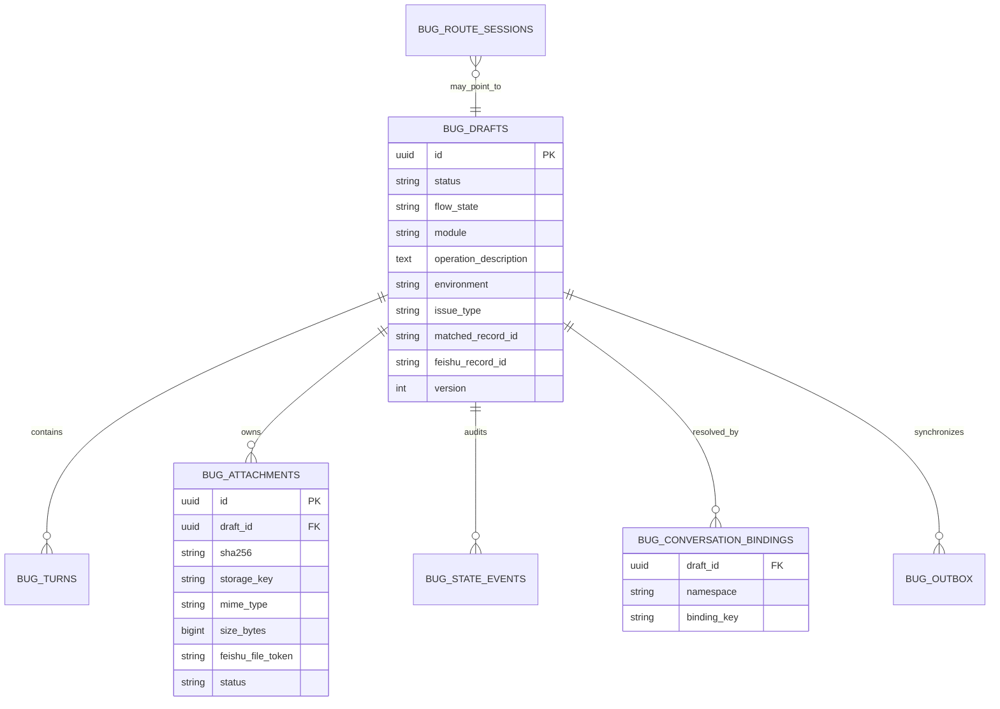

# Bug 反馈关系型事实源设计

## 业务边界

一条 Bug 反馈不是“一段会话”，而是一个有独立生命周期的业务草稿。一个 H5/企微会话可以先后产生多个草稿；一条草稿可以包含多轮文本和多张附件。图片必须绑定草稿 UUID，不能只绑定 conversation_id。

120 的 Bug 服务拥有草稿、状态、附件归属和飞书同步；124 H5、企微和 Dify 只能调用内部 API。Dify 负责意图识别和结构化字段提取，飞书是最终协作视图，不是会话状态源。

## 数据关系

## 关键不变量

1. 每张图片只有一个 `draft_id` 归属；同一草稿按 `sha256` 去重。
2. 同一 Dify conversation 的“当前草稿”通过 binding 表解析；新问题开始时创建新 UUID，并把旧活动草稿标记为 `superseded`。
3. H5 的 `session_id -> conv_a/conv_b/active` 持久化到数据库，124 重启后可以恢复，不再依赖进程内字典。
4. 图片二进制写持久文件存储，数据库只保存元数据；文件名使用 UUID/SHA256，不信任用户文件名。
5. 飞书每条记录写入“业务草稿ID”，重试前先按该字段查询，避免请求超时后的重复建单。
6. `/add` 只有在全部待同步附件成功上传后才写主记录；失败保留草稿和 outbox，不能静默丢图后返回成功。
7. 对同一 binding 使用 PostgreSQL advisory transaction lock，草稿使用乐观版本列，避免多 worker 并发覆盖。

## 兼容迁移

Dify B 的 search/add/update 请求增加 `conversation_id`、`flow_state`、原始当轮文本和幂等键。首次/新话题在 `IDLE` 发起 search 时携带 `force_new=true`；修改当前问题时保持 `false`。服务端返回 `draft_id`，旧工作流即使暂不消费该字段，也可以通过 conversation binding 找到同一草稿。

H5 图片在 Dify B 完成本轮 search 后写入 `/cache-image`，120 此时已能把 conversation 解析到正确草稿。企微图片在 B chatflow 返回后由 120 直接持久化到同一草稿。

## 部署与回滚

- 独立 `bugtrack-postgres`，仅监听 `127.0.0.1:55432`，不复用服务器上其他项目数据库。
- Alembic 管理 schema；每天 custom-format `pg_dump`，保留 14 天。
- 附件目录和数据库备份同时保护。
- Dify patch 只修改 effective published + draft，历史 published 保持可回滚。
- 回滚应用时数据库表和附件保留；旧接口字段全部向后兼容，不需要删除生产数据。

