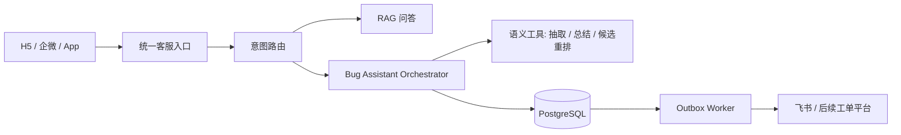

# Bug 反馈工作流 v2 迁移规划

## 1. 目标与边界

目标是把 Bug 反馈从 Dify 会话状态机迁移为后端领域服务控制的事务流程，同时保留现有 RAG 问答能力。

迁移期间必须满足以下约束：

1. M4 前保留 Dify A/B 配置回退；M4 后通过已验证的源码、镜像和环境归档做代码级回退。
2. PostgreSQL 是草稿、附件、报告、状态事件和同步任务的事实源。
3. 飞书是协作视图，不是会话状态源，也不负责判断两个反馈是否为同一问题。
4. LLM 只负责意图识别、字段抽取、候选排序和回复生成，不负责状态跳转与写入成功判定。
5. 一次用户反馈建模为 `Report`，研发处理的问题建模为 `Issue`；多个 Report 可以关联同一个 Issue。
6. M0-M3 通过配置切流；M4 移除 B 活路径后必须恢复旧源码/镜像才能回退，不能只改开关。

## 2. 迁移前基线

当前生产路径：

```text
H5 / 企微
  -> A/B ChatflowRouter
  -> Dify A（知识问答）或 Dify B（Bug 状态机）
  -> 120 Bug API
  -> PostgreSQL 草稿/附件/outbox
  -> 飞书多维表格
```

当前可复用资产：

- `bug_drafts`：独立业务草稿 UUID 和当前流程状态。
- `bug_turns`：原始用户轮次、意图和结构化补丁。
- `bug_attachments`：按 draft 归属并以 SHA-256 去重的附件。
- `bug_state_events`：状态审计事件。
- `bug_conversation_bindings`：外部会话到草稿的绑定。
- `bug_outbox`：飞书写入幂等和失败重试基础。
- `bug_route_sessions`：保留 H5 路由兼容字段；M4 运行态固定为 A。

当前需要替换的部分：

- Dify B 中的 `cv_flow_state` 和大量确认/修改分类分支。
- A/B 之间的隐藏 `SYS` marker 控制协议。
- 将候选召回结果直接解释为“已存在问题”的二元判断。
- 用户补充信息直接修改旧 Bug 行的模型。
- 依赖 30 分钟窗口推断新话题或旧问题修改的逻辑。

## 3. 目标架构



控制权分配：

| 能力 | 最终责任方 |
|---|---|
| 知识检索与问答 | Dify A / RAG 服务 |
| 顶层意图路由 | 后端规则 + 结构化 LLM 分类 |
| Bug 状态跳转 | Bug Assistant Orchestrator |
| 字段抽取与文本整理 | 无状态 LLM 工具 |
| 候选召回 | Bug 服务的混合检索 |
| 是否合并 Issue | 用户确认关联 + 产品/研发治理 |
| 草稿、附件、报告、订阅 | PostgreSQL |
| 外部表格同步 | Outbox Worker |

## 4. 领域模型

### 4.1 Issue

研发实际处理的缺陷或产品问题。保存规范化描述、模块、状态以及外部协作系统映射。

### 4.2 Report

某个用户的一次问题反馈。保存本次环境、描述、附件、来源和关联结果。即使命中已有 Issue，也必须生成独立 Report，不能覆盖 Issue 内容。

### 4.3 Subscription

用户对 Issue 进度的订阅关系。后续状态变化通过异步通知发送，不依赖用户保持原对话窗口。

### 4.4 Draft

未完成的 Report 草稿。继续复用现有 `bug_drafts`，避免破坏已验证的附件和幂等链路。

## 5. v2 状态机

稳定状态：

```text
collecting
  -> matching
  -> awaiting_match_confirmation
  -> ready_to_submit
  -> queued_for_submission
  -> submitted

任意非终态 -> suspended / abandoned
awaiting_match_confirmation -> linked_existing
```

状态规则：

- `collecting`：只收集提交所需的最少信息，每轮最多追问一个关键字段。
- `matching`：后端执行候选召回，不等待 LLM 决定状态。
- `awaiting_match_confirmation`：向用户展示候选 Issue，由显式按钮或结构化事件确认。
- `ready_to_submit`：没有可靠候选或用户否认候选，等待一次最终提交确认。
- `linked_existing`：创建 Report 并关联已有 Issue，同时建立订阅，不修改 Issue 主记录。
- `queued_for_submission`：新 Issue/Report 已落本地库，等待 outbox 同步外部系统。
- `submitted`：外部同步完成。
- `suspended`：用户临时转问知识问题，草稿保留。
- `abandoned`：用户明确取消或草稿过期。

禁止行为：

- LLM 直接给出下一状态。
- 低分候选自动合并。
- 用户确认已有问题后直接结束且不记录本次 Report。
- 附件未持久化就执行提交。
- 外部 API 超时后重复创建记录。

## 6. v2 内部接口契约

首个兼容接口：

```text
POST /internal/bugtrack/v2/turn
```

请求示例：

```json
{
  "event": "START_REPORT",
  "conversation_id": "conv-b-1",
  "session_id": "h5-session-1",
  "channel": "h5",
  "user_key": "h5-session-1",
  "source_text": "后台订单结算失败",
  "fields": {
    "module": "订单管理",
    "operation_description": "后台订单结算失败",
    "environment": "Web后台",
    "issue_type": "bug",
    "search_keyword": "结算失败"
  },
  "idempotency_key": "h5-message-id"
}
```

响应只返回结构化动作，不让调用方解析自然语言：

```json
{
  "success": true,
  "draft_id": "...",
  "state": "awaiting_match_confirmation",
  "next_action": "CONFIRM_MATCH",
  "missing_fields": [],
  "candidate": {
    "external_record_id": "rec-1",
    "match_score": 136.5
  }
}
```

M0 支持的事件：

- `START_REPORT`
- `PATCH_REPORT`
- `CONFIRM_MATCH`
- `REJECT_MATCH`
- `CONFIRM_SUBMIT`
- `SUSPEND`
- `CANCEL`

所有事件均由后端校验当前状态；非法跳转返回 `409`，不能静默纠正。

## 7. 分阶段实施

### M0：领域基础与兼容契约

- 新增 `bug_issues`、`bug_reports`、`bug_subscriptions`。
- 新增确定性编排服务和 v2 内部接口。
- 保持现有 `/search`、`/add`、`/update` 和 Dify A/B 行为不变。
- 完成 SQLite 单元测试与 Alembic upgrade/downgrade 验证。

完成门槛：相关测试全绿，迁移可逆，生产没有任何流量变化。

### M1：影子接流

- 已按业务决定跳过：当前 Dify B 没有活跃用户，不再投入双写与差异对账实现。
- v2 仍使用独立 binding namespace，禁止复用 legacy Dify conversation binding。
- 跳过 M1 不等于删除回滚：M2 保留 `off` 开关和 Dify B 入队前回退。

状态：2026-07-28 经用户确认跳过。

### M2：新 Bug 提交切流

- H5/企微的新 Bug 首轮与后续确认轮切到 v2 编排服务。
- v2 创建 Issue + Report，outbox 同步飞书。
- 候选已有问题暂由 Dify B 继续处理，v2 会传递完整问题描述后回退。
- 现有 Dify B 保留为配置级回退路径，但只允许在本地 Issue/Report 入队前使用。
- 一旦进入 `queued_for_submission`，外部同步失败只走 outbox/Celery 重试，禁止回退 B 重复建单。

完成门槛：重复写入率和附件丢失率为 0；提交完成率不低于旧流程；平均轮数下降。

### M3：已有 Issue 关联和订阅

- 命中候选后由用户显式确认，再建立 Report -> Issue 关联；候选路径不再回退 Dify B。
- 每次重复发生都创建独立 Report 和 Subscription，不覆盖飞书已有 Issue 行。
- 原始渠道没有 module 时，使用长描述锚点召回和高相似度展示闸门；只展示候选，绝不自动关联。
- 飞书问题状态、产品回复和完成结果通过定时只读同步生成 IssueStatusEvent。
- 每个订阅者生成幂等 NotificationDelivery：企微客服主动推送，H5 拉取并 ack，企微机器人在下一次会话补偿投递。
- 提供 Issue 影响统计接口，按内部 issue_id 或飞书 record_id 查看 Report 数和订阅人数。

完成门槛：误关联率经过人工抽检可接受；用户能够收到准确进度；产品可查看 Issue 的报告数量和影响范围。

### M4：移除 Dify B 状态机

- H5/企微使用后端故障意图门控直接进入 v2；普通 FAQ 只调用 Dify A。
- 运行态不构造 Dify B client，不解析 SWITCH marker 做改投，也不缓存 B conversation 图片。
- `active`/`conv_b` 数据库列和接口字段继续保留兼容；旧值读取后忽略，新写入统一为 `active=A`、`conv_b=""`。
- 候选检索异常保留当前 v2 草稿并提示重试，不再 abandon 草稿后请求旧 B 接管。
- Dify B token、镜像和历史归档保留为人工代码级回滚资产，不删除生产历史数据。

完成门槛：全量流量稳定运行一个观察周期，回退演练完成，旧流程不再接收新流量。

### M5：暂停转问答与结构化操作

- 活跃的非终态 Draft 遇到高置信度、已核实的知识问题时，渠道先向编排服务发送 `SUSPEND`，再走 Dify A/RAG；知识文本不得作为 Draft 字段补充。
- `SUSPEND` 只改变 Draft 的 `flow_state` 并记录状态事件；附件、原始反馈、候选和幂等关联保持不变。
- 仅通过 `RESUME` 结构化动作或企微文本回退“继续反馈”恢复到暂停前状态。暂停期间收到新的故障文本，必须提示用户继续或取消，不能覆盖旧 Draft。
- `bug_progress` 是独立只读路径，不改变活跃 Draft；仅展示当前订阅者关联的 Issue 进展。
- 所有渠道返回 `intent`、`confidence`、`entities` 与 `actions`。H5 用按钮提交 `action_id`；企微保留等价的文本操作提示。

完成门槛：FAQ 转问答后草稿状态和附件不丢失；恢复后回到原确认状态；进度查询没有新增 `BugTurn` 或状态事件；H5 按钮与企微文本回退覆盖确认、取消、暂停和恢复。

## 8. 切流与回滚

M2/M3 接流配置使用：

```text
BUGTRACK_ORCHESTRATOR_MODE=off | active
BUGTRACK_ORCHESTRATOR_FALLBACK_TO_DIFY_B=true | false
BUGTRACK_STATUS_SYNC_INTERVAL_SECONDS=300
BUGTRACK_STATUS_SYNC_BATCH_SIZE=100
```

- M4 代码运行时固定使用 Dify A + Bug v2；`off` 只会暂停 v2，不会重新启用 B。
- `active`：v2 负责新 Bug 路径；异常保留草稿或结束本轮并提示重试。
- `BUGTRACK_ORCHESTRATOR_FALLBACK_TO_DIFY_B=false`：关闭旧 B 回退，失败时保留/结束 v2 会话并提示重试。
- M4 仍保留 `FALLBACK_TO_DIFY_B` 配置字段用于审计和旧版本回滚，但新代码不读取它决定路由。
- `STATUS_SYNC_INTERVAL_SECONDS=0`：停止定时飞书进度轮询，但不删除订阅、事件或通知历史。

M4 回滚不能只改配置：必须恢复 M3 源码/镜像，再恢复 `active + fallback=true` 配置。数据库新增表、历史 `conv_b`、附件和迁移归档均保留，不做破坏性清理。

每个里程碑必须提供：数据库 downgrade、配置回退、接口兼容和数据对账脚本。不得通过删除历史表或附件完成回滚。

## 9. 验收指标

硬性不变量：

- 附件丢失率为 0。
- 同一幂等键重复创建数为 0。
- 非法状态跳转写入数为 0。
- 低于匹配阈值的候选自动关联数为 0。

产品指标：

- Bug 提交完成率。
- 从首次反馈到提交的中位轮数。
- 候选误关联率与漏召回率。
- 转人工率。
- 进度查询准确率。
- 新旧流程决策差异率。

## 10. 当前进度

| 里程碑 | 状态 |
|---|---|
| M0 领域基础与兼容契约 | 已部署，生产 revision 为 `7b260728a1f0` |
| M1 影子接流 | 经用户确认跳过 |
| M2 新 Bug 提交切流 | 已部署并启用 `active`，旧 B 保留入队前回退 |
| M3 已有 Issue 关联和订阅 | 已部署并启用，候选确认和进度通知走原生 v2 |
| M4 移除 Dify B 状态机 | 已部署，Dify B 不再接收新流量 |

### M0 实现记录（2026-07-28）

- 新增 `bug_issues`、`bug_reports`、`bug_subscriptions` ORM 与 Alembic 迁移。
- 新增 `POST /internal/bugtrack/v2/turn` 结构化事件接口。
- 新增确定性状态机、候选阈值闸门、Issue/Report 关联和订阅幂等。
- v2 使用独立 `<channel>_v2` binding namespace，不会修改 legacy Dify 草稿。
- 已验证 Alembic upgrade -> downgrade -> re-upgrade。
- `alembic check`：No new upgrade operations detected。

### M3 实现记录（2026-07-28）

- 新增 `bug_issue_status_events` 和 `bug_notification_deliveries`，生产 revision 为 `6f4e2c91ab73`。
- H5/企微统一消息服务原生支持 `CONFIRM_MATCH`、`REJECT_MATCH` 和候选补充信息重匹配。
- 确认已有问题后创建独立 Report、Subscription，不新增或修改飞书记录；影响统计接口支持 issue UUID 和飞书 record_id。
- 新增 `wecom-celery-beat.service`，每 300 秒触发一次有订阅 Issue 的飞书只读同步；worker 负责企微客服通知重试。
- H5 新增 `/api/notifications` 和 `/api/notifications/ack`，前端每 30 秒及页面重新可见时拉取未读进度。
- 原始消息无 module 时增加长描述锚点召回；高相似候选必须满足最少公共字符数，并仍由用户显式确认。

生产验证：

- 真实飞书已有问题返回 `awaiting_match_confirmation`，未回退 Dify B。
- 用户确认后 Draft 为 `linked_existing/submitted`，Report 为 `confirmed_duplicate`，Subscription 为 active。
- 飞书原记录验证前后 SHA-256 一致，确认未修改已有行。
- 人工制造本地旧状态后，飞书只读同步创建 1 个状态事件和 1 个 H5 通知；公网拉取和 ack 成功。
- 验收 Draft、Issue、Report、Subscription、StatusEvent、NotificationDelivery 和 route session 已全部清理，残留数为 0。
- WeCom 全量测试 `319 passed, 6 skipped`；H5 后端全量测试 `300 passed`；前端 lint/build 通过。

生产验证中修复了两个仅在 PostgreSQL/Celery 进程模型下暴露的问题：

- PostgreSQL 的 `SELECT DISTINCT` 不允许按未选择列排序；轮询查询改为按已选择的 Issue UUID 排序，并补 PostgreSQL dialect 编译测试。
- Celery 同步任务反复 `asyncio.run()` 时不能复用上一事件循环的 asyncpg 连接；所有数据库型 Celery 任务结束时显式 dispose SQLAlchemy engine。生产连续执行两次轮询任务均成功。

M3 快速回滚顺序：

1. 120 停止并禁用 `wecom-celery-beat.service`，避免继续生成状态事件。
2. 124 使用归档中的旧镜像恢复 backend-dify 和 frontend，或恢复 `source-before.tar.gz` 后重建。
3. 120 恢复 `source-before.tar.gz` 并重启 API/worker；新增表可保留，不影响 M2。
4. 只有需要完整 schema 回退时才执行 Alembic downgrade 到 `7b260728a1f0`；先备份数据库，禁止删除归档或附件。

本次生产归档：`/root/migration-archives/bugtrack-m3-20260728_183807`。
- Bug 服务全量测试：300 passed，6 skipped。
- 主项目生产后端测试：290 passed。
- 本阶段没有部署、没有生产接流、没有修改现有 Dify A/B 用户行为。

### M4 本地实现记录（2026-07-28）

- H5 `ChatflowRouter` 只构造 Dify A client；显式 Bug 意图直接调用 120 v2 编排服务，v2 异常和防御性 `fallback_required` 均不再调用 Dify。
- 企微 `DifyService` 只构造 A client；`MessageProcessor` 使用保守故障意图门控直接调用 v2，删除 A/B marker 改投循环。
- `timer_coordinator` 只保留 TIMER 协调，删除 `SWITCH_TO_BUG`、`SWITCH_TO_KB_REENTRY`、`SWITCH_TO_KB_DONE` 控制协议。
- H5 route session、企微 ConversationStore 和 120 route-session 写接口均把历史 B 状态归一为 `active=A`、`conv_b=""`；PostgreSQL 列未删除。
- 候选检索失败不再生成 legacy fallback，也不 abandon 草稿；用户可在同一 v2 草稿上重试。
- 默认/示例配置改为 `BUGTRACK_ORCHESTRATOR_FALLBACK_TO_DIFY_B=false`，B token 字段仅作为人工回滚资产保留。

本地验证：

- H5 后端全量测试：`300 passed`。
- WeCom 全量测试：`323 passed, 6 skipped`。
- 前端 ESLint、TypeScript/Vite 生产构建通过。
- M4 相关 Python 文件 Black 检查和两仓库 `git diff --check` 通过。

### M4 生产部署记录（2026-07-28）

- 120 与 124 均保持 `BUGTRACK_ORCHESTRATOR_MODE=active`，并切换为 `BUGTRACK_ORCHESTRATOR_FALLBACK_TO_DIFY_B=false`。
- 120 `DifyService` 运行态只包含 A client；API、Celery worker、Celery beat 均 active，Alembic revision 保持 `6f4e2c91ab73`。
- 124 backend-dify 新镜像为 `sha256:3ae2ab01e18ce0fd4550efced9fcc4614981aebffbb639290b2c0f3f6f98215b`；健康检查返回 `dual_app=false`、`bugtrack_orchestrator_active=true`。
- 真实 H5 验收：确定性 FAQ 正常；Bug 首轮进入 `ready_to_submit`，route session 为 `active=A`、`conv_b=""`、`bug_v2_active=true`；取消后进入 `abandoned` 且 `bug_v2_active=false`。
- 公网 `/chat/api/health`、FAQ 请求和 `/chat/assets/*` 子路径均通过；本地环境访问生产证书需要 `curl -k`，属于现有自签名证书链，不是 M4 回归。
- 生产验收 draft 和 route session 已按专用 `m4-prod-*` session 精确清理，残留均为 0；未创建飞书测试行。

回滚演练：

- 120 从 M4 归档启动 M3 源码、从 M3 归档启动 M2 源码，分别在备用端口通过 Bug API 健康检查。
- 124 使用保留的 M3 镜像 `sha256:1f7847c86caa353f06dc5cb45e1d4bf14310db0570a188dcdb78c1771abde8a2` 和 M2 镜像 `sha256:a434b7a9f895d5d1c4448b3a3ed8bf9736592a9871069e8f60ff462534179ed3` 在备用端口通过健康检查。
- 演练不切换在线流量；备用进程、容器和端口均已清理。

生产验证注意事项：

- 120 的测试进程默认会读取生产 `.env`。首次运行关系型测试时误连接生产 PostgreSQL，测试 fixture 清除了 Bug 表；发现后立即停止测试，并使用部署前已校验的 custom dump 完整恢复。
- 恢复后核验 revision=`6f4e2c91ab73`、部署前业务计数、API/worker/beat 健康均一致；随后使用 `DATABASE_URL=sqlite+aiosqlite:////tmp/...` 隔离重跑 M4 影响面，结果 `96 passed`。
- 后续严禁在生产源码目录直接运行含 `Base.metadata.drop_all/create_all` 的测试；必须显式覆盖临时 SQLite URL 和附件目录。

本次双机生产归档：`/root/migration-archives/bugtrack-m4-20260728_203458`。归档包含部署前后源码、环境、服务/Compose 状态、PostgreSQL custom dump、镜像 ID、回滚探针结果和递归 SHA-256 清单。

### M4 真实 E2E 路由修复（2026-07-29）

生产根因：

- 企微消息 `【E2E-04】PC后台测试订单点击生成结算单后提示未知错误` 只包含“错误”，而 M4 企微门控未包含该词，因此没有进入 Bug v2。
- 消息携带旧 FAQ conversation 调用 Dify A，33 秒后返回长度为 24 的 `<!--SYS:SWITCH_TO_BUG-->`；M4 仅剔除标记，清理后变成空文本，最终回复“AI 未返回内容”。
- 120 只读查询确认失败时间窗口内没有 `bug_drafts` 或 `bug_turns`，证明并非 v2 内部异常。

修复：

- H5 和企微共用同一份生成策略结构，补充“错误/故障/卡住/无响应/打不开/error/failed”等故障表达，并用“错误码解释/如何避免操作错误/能力咨询”反例防止误建 Bug。
- 企微在 Dify A 前执行已核实 FAQ 快速路径，计费模板和订单导出与 H5 返回相同的标准 PC 菜单。
- 历史 `SWITCH_TO_BUG` 不再被盲目清空：未被反例策略拦截时改投 v2，明确的非 Bug 问题则返回中性澄清，不创建草稿。
- 空工作流回复改为可行动文案；泛化错误码问题改为确定性澄清，生产延迟从 28.16 秒降到 0.38 秒。

验证：

- 本地 H5 后端：`318 passed`；本地 WeCom：`342 passed, 6 skipped`。
- 生产 120 显式 SQLite/临时附件目录隔离：`56 passed`；124 新镜像临时容器：`39 passed`。
- 真实 H5 与生产 WeCom `MessageProcessor` 均对 E2E-04 返回待确认文案，取消后进入 `abandoned`；计费模板和订单导出约 0.3 秒返回核实答案。
- 测试草稿和 route session 按精确 ID 清理，最终残留为 0；所有 Bug 表计数与发布前完全一致，revision 仍为 `6f4e2c91ab73`。
- 120 API/worker/beat 均 active；124 镜像为 `sha256:18e6d2a7d50326ad6e63c2ec44836ca807ccf384a9fa84fc7b9a3ba95a068166`，公网 H5 和企微健康接口均为 HTTP 200。

本次双机回滚归档：`/root/migration-archives/bugtrack-e2e04-20260729_121533`。归档包含发布前后源码、配置、服务/Compose 状态、镜像元数据、120 PostgreSQL 前后 custom dump 及递归 SHA-256 清单。

### M4 深度对抗与并发验收（2026-07-29）

在 E2E-04 根因修复后，继续使用中英文、标点/空格变体、知识问答反例、图片、多轮状态和并发请求进行对抗测试。首轮矩阵额外发现 10 个路由错误：真实故障“请看截图，页面有问题”被漏判；“失败订单在哪里查看”“系统错误日志在哪里查看”“如何配置失败重试次数”“故障记录怎么导出”“系统支持异常订单筛选吗”及对应英文问题被误判为 Bug。

本轮修复：

- 故障词扩展为控件失效、持续加载、白屏/黑屏、超时、不显示/数据缺失、金额异常、重复扣费、离线/断连、乱码及英文等价表达。
- 新增知识问题、能力问题和强事故上下文闸门；“失败/错误/故障”等词只有在实际事故语境中才进入 Bug v2。
- 匹配统一忽略空白、常见标点、连字符、斜线和大小写，覆盖“无 响应”“not-responding”等输入变体。
- H5 未传语言和企微无语言元数据时，根据输入文字自动推断中英文；英文确定性回复不再返回中文。
- Bug 路由、非模糊确定性回复均重置模糊澄清计数；历史 `SWITCH_TO_BUG` 兼容信号同时清除污染的 Dify A `conv_a`。
- Dify A 返回旧标记但输入属于产品用法咨询时，改为上下文相关澄清，不再追问无关错误码。
- 新增已核实的失败/异常订单入口快速答复：`财务 > 订单中心 > 充电桩订单 > 新能源车充电订单`，再按订单状态筛选。
- 增加 H5 与企微策略源码、生成知识产物的自动同步测试，防止两个入口再次发生策略漂移。

验证结果：

- 本地 H5 后端：`353 passed`；本地 WeCom：`374 passed, 6 skipped`。
- 核心覆盖率：策略 `93%`，`MessageProcessor` `83%`，合并 `86%`。
- 生产隔离测试：120 使用显式临时 SQLite 和附件目录执行 `88 passed`；124 新镜像临时容器执行 `73 passed, 1 skipped`。
- 生产真实 E2E 覆盖空格故障词、英文自动推断、失败订单快速答复、知识问题负例、模糊状态重置、图片 Bug 创建/取消和旧标记状态清理。
- PostgreSQL 并发验证：相同 `message_id` 的两个并发请求只生成 1 个 draft 和 1 个 turn；两个不同补充消息并发写入同一 draft 后共 3 个 turns，两个补充均保留，无丢失更新。
- 所有 `codex-deep-*` 草稿、路由会话和图片目录均精确清理；最终计数恢复为 drafts=34、turns=60、attachments=4、state_events=167、route_sessions=0，Alembic 保持 `6f4e2c91ab73`。
- H5 与企微策略文件及 `shared/charge_service.yaml` SHA-256 一致；两仓 `git diff --check` 和事实生成器 `--check` 通过。

最终生产状态：

- 120 API、Celery worker、Celery beat 均 active，Bugtrack 内部健康检查确认数据库和附件存储正常。
- 124 backend-dify 镜像为 `sha256:a257f4a6ab1a91f4f436d95008cbc4b6effbf6247ba4bde3035b96f549ae74d5`，容器 healthy，`dual_app=false`、Bug v2 active。
- 公网 H5 `/chat/api/health` 返回 HTTP 200；120 内部 `/monitoring/health` 和 `/internal/bugtrack/health` 返回 HTTP 200。企微公网域名只代理 `/wechat/`，无签名 callback 探针返回后端 JSON 422，证明回调路径正确到达服务；`/monitoring/health` 未对公网暴露，不能用站点 SPA 的 200 作为后端健康证据。

本次双机增量回滚归档：`/root/migration-archives/bugtrack-deep-e2e-20260729_132136`。归档包含发布前后源码和配置、120 前后 PostgreSQL custom dump、systemd/Compose 状态、最终镜像元数据、业务计数、健康结果、部署摘要和递归 SHA-256 清单。

### M2 实现记录（2026-07-28）

- 新增 `POST /internal/bugtrack/v2/message`，接收 H5/企微原始文字与图片，并把自然语言轮次映射为确定性事件。
- 新 Bug 需要一次显式“确认提交”；补充文字追加到当前 Report 草稿，图片直接绑定 v2 draft。
- H5 支持显式 `message_id`，前端每次发送生成稳定 UUID；后端仅在旧客户端未传时生成兜底 ID。
- H5 与企微均持久化 `bug_v2_active`，服务重启后确认轮仍直接续接 v2，不经过 Dify A/B。
- A 的 `SWITCH_TO_BUG` 和 H5 明确 Bug 快路由均优先调用 v2；候选已有问题使用完整描述回退 Dify B。
- 新增 `create_issue_v2` outbox 同步服务和 Celery 重试任务；飞书写入按 `业务草稿ID` 查询后新增/更新，附件上传幂等。
- 飞书失败时返回 `sync_pending=true`，数据库保持 `queued_for_submission`、outbox 保持 `pending`；重试成功后转为 `submitted`，全程不回退 Dify B。
- H5 编排服务续轮超时、企微编排服务续轮异常时，均保留 v2 会话并提示重试，不会把“确认提交”误送到知识库或旧 B。
- H5 编排开关默认 `off`；生产上线经过 `off` 回归后再切换为 `active`。
- Bug 服务全量测试：310 passed，6 skipped；Black 与目标 Flake8 检查通过。
- 主项目生产后端测试：298 passed；前端 ESLint 与生产构建通过。

### M2 生产部署记录（2026-07-28）

访问与回滚点：

- 为 120（端口 2134）与 124 配置了专用 ED25519 公钥，指纹为 `SHA256:xvYvJ8B09c47JVRS/X+IVEzHU+nhkgVC4g60br3S73w`；原 `authorized_keys` 未覆盖。
- 120 回滚归档：`/root/migration-archives/bugtrack-m2-20260728_170500`，包含源码、`.env`、systemd 单元、附件 tar 和 PostgreSQL custom dump；dump 已通过 `pg_restore -l` 校验。
- 124 回滚归档：`/root/migration-archives/bugtrack-m2-20260728_170500`，包含源码、`.env.dify`、Compose 状态和旧镜像元数据。
- 124 旧镜像：backend `sha256:b686c8dde2a018878d2ba5648cb32fadb43e1974f104be7deefff9c31da219d7`，frontend `sha256:f3128c79bf748acd2fa93b9ac05c7710a2e819516ddd0a302ac76f0e8497d0ba`。
- 124 当前镜像：backend `sha256:a434b7a9f895d5d1c4448b3a3ed8bf9736592a9871069e8f60ff462534179ed3`，frontend `sha256:49d25a6bc73ed8d0acd6ad760010da5629f309c44a2dafa7f8e294a753f3855f`。

部署与验证结果：

- 120 Alembic 从 `18d131f67f3e` 升级到 `7b260728a1f0`；`bug_issues`、`bug_reports`、`bug_subscriptions` 存在，`alembic check` 无待生成迁移。
- 120 `wecom-api.service` 和 `wecom-celery-worker.service` 均为 active；Celery 已注册 `app.tasks.bugtrack_sync_v2_issue`。
- 124 在 `off` 模式完成 FAQ 快答和旧 B 首轮回归后切换；最终 health 返回 `bugtrack_orchestrator_mode=active`、`bugtrack_orchestrator_active=true`。
- H5 生产端到端完成：首轮带图创建 v2 draft，重启 backend-dify 后恢复 `bug_v2_active`，确认后创建 Issue、Report、Subscription 并同步飞书。
- 数据库核验：draft/Issue/Report 均为 `submitted`，Subscription 数为 1，附件为 `synced`，`create_issue_v2` outbox 为 `succeeded` 且 attempts=1。
- 飞书核验：`业务草稿ID` 与 PostgreSQL draft 一致，操作描述一致，附件数为 1。
- 验收时发现无 module 的原始消息无法越过候选阈值；上线过程立即回退 `off`，增加“长度足够的完整操作描述精确匹配”加分，并补充短泛化句反例测试。修复后生产已验证精确旧问题回退 Dify B。
- 飞书测试行、6 个测试 draft、对应 Issue/Report/Subscription/outbox、附件文件和测试 route session 已全部清理，残留数为 0。
- 最终 120 与 124 均为 `BUGTRACK_ORCHESTRATOR_MODE=active`，`BUGTRACK_ORCHESTRATOR_FALLBACK_TO_DIFY_B=true`。

快速回滚顺序：

1. 先将 124 `backend/.env.dify` 的模式改为 `off` 并重建 `backend-dify`，再将 120 `.env` 的模式改为 `off` 并重启 `wecom-api.service`。
2. 普通业务回滚只关闭切流，不删除新表、不降级数据库，已有 queued outbox 继续由 Celery 幂等完成。
3. 若需代码级回滚，从两台机器的时间戳归档恢复文件和环境配置；124 可把旧镜像 ID 重新标记为 Compose 默认镜像后强制重建容器。
4. 只有确认新表没有需要保留的数据时，才允许从 custom dump 恢复或执行 Alembic downgrade；不得为回滚外观删除迁移归档、附件或兼容路径。
